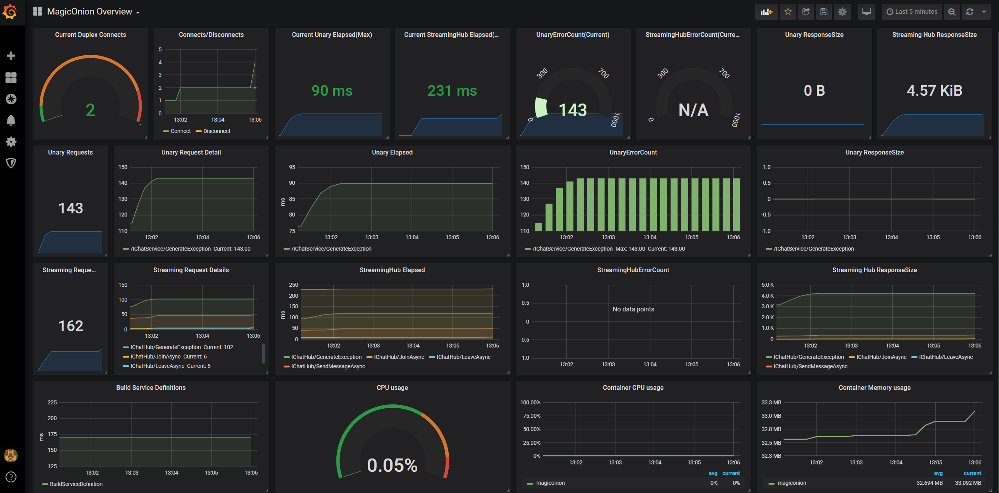

## magic onion overview dashbaord

* dashboard id: [10584](https://grafana.com/grafana/dashboards/10584)

MagicOnion Dashboard for prometheus, collected exporter via Open Telemetry for .NET.

cAdvisor is also used to collect container CPU and Memory stats.

## Components

* datasource: [Prometheus](https://prometheus.io/)
* exporter: [opentelemetry-dotnet](https://github.com/open-telemetry/opentelemetry-dotnet)
* application: [MagicOnion v2](https://github.com/Cysharp/MagicOnion)
* container: [cAdvisor](https://github.com/google/cadvisor)

## Screenshot

